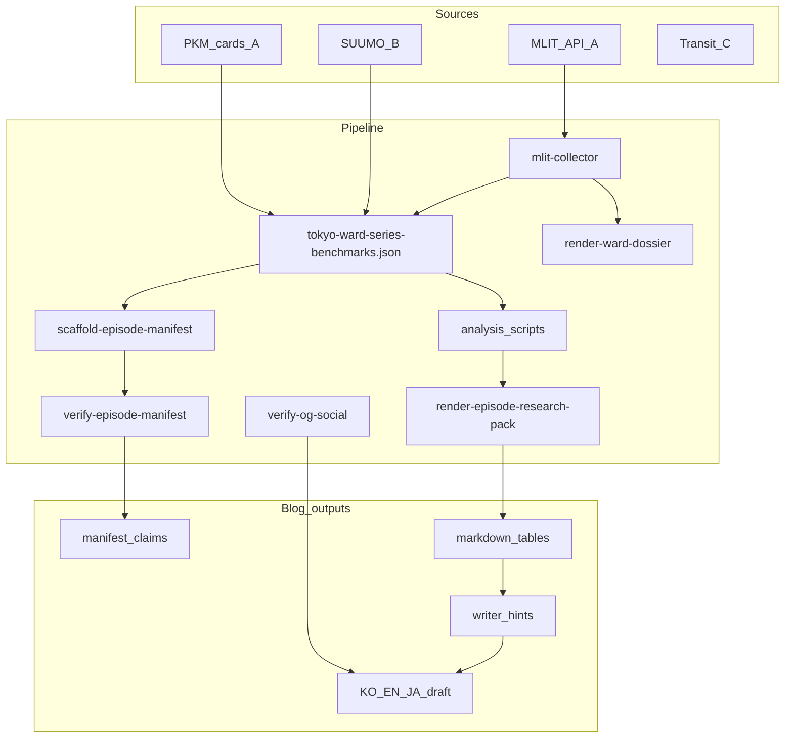

# MLIT 투자 보조자료 → 블로그 파이프라인 계획

## 목표와 원칙

**목적:** 국토교통성(MLIT) 등 검증 기관 1차 데이터로 **구·에피소드 단위 매크로 흐름**을 파악하고, 이를 **신뢰성 있는 블로그 수치·서술**로 전환한다.

**범위 (명시):**

- 포함: 구/町名/에피소드 스크리닝, 추세, 상대 비교, 리스크·수요 프록시, yield proxy(세전·표면)
- 제외: 개별 맨션 매입 판단, REINS 물건별 시세, 공실·관리비 실측

**데이터 계층 (기존 유지, [BLOG_EPISODE_VERIFICATION_PIPELINE.md](docs/BLOG_EPISODE_VERIFICATION_PIPELINE.md) 준수):**




---

## 클로드 검토 반영 요약 (2026-06-17)


| 항목       | 클로드 의견                           | Cursor 검토 결과                                                                                                      | 계획 반영                                   |
| -------- | -------------------------------- | ----------------------------------------------------------------------------------------------------------------- | --------------------------------------- |
| Phase 순서 | 2c는 Phase 3 이후                   | **동의** — 2a·2b는 pack에 바로 넣을 수 있으나 2c(manifest)는 pack 구조 확정 후                                                      | 아래 **실행 순서표**로 분리                       |
| 町名 라벨    | `NearestStation` → `District` 변경 | **부분 수정** — `collectPrice()`는 이미 `DistrictName` 집계. 문제는 `stations: districts` **오해 유발 alias** + downstream 라벨 미강제 | alias 제거·writer_hints·verify 금지어        |
| n<30 규칙  | 4단계 기준 필요                        | **동의**                                                                                                            | benchmarks `blog_primary` + verify 하드코딩 |
| 배포 체크    | OG/JPEG 누락                       | **동의** — Ep.06 LinkedIn 사례                                                                                        | Phase 5에 `verify-og-social.mjs`         |


---

## 거래 건수(n) 처리 규칙 (SSOT — benchmarks·verify·pack 공통)


| 건수 n         | `blog_primary` | 블로그 본문                            | manifest                                    |
| ------------ | -------------- | --------------------------------- | ------------------------------------------- |
| n ≥ 100      | `true`         | 수치 직접 인용 가능                       | `tier: primary` 허용                          |
| 30 ≤ n < 100 | `true`         | 인용 가능, **"n=XX건 기준" 각주 필수**       | `tier: primary` + `footnote_required: true` |
| n < 30       | `false`        | **본문 수치 사용 금지** — "거래 적어 참고치" 서술만 | `used_in_draft: false`                      |
| n < 10       | `false`        | 완전 제외                             | scaffold에서 claim 생성 스킵                      |


구현 위치:

- [scripts/mlit-price-series.mjs](scripts/mlit-collector.mjs) — 연도별 `count` + `blog_primary` 플래그
- [docs/verification/tokyo-ward-series-benchmarks.json](docs/verification/tokyo-ward-series-benchmarks.json) v1.2 — `sample_size_policy` 섹션
- [scripts/verify-episode-manifest.mjs](scripts/verify-episode-manifest.mjs) — primary claim이 n<30 evidence면 **fail**
- [scripts/render-episode-research-pack.mjs](scripts/render-episode-research-pack.mjs) — Writer constraints에 n-tier 표 포함

---

## 町名 라벨 규칙 (코드·문서·검증 3중 강제)

**현재 코드 상태:** [mlit-collector.mjs](scripts/mlit-collector.mjs) `collectPrice()`는 `DistrictName`(町名)으로 집계한다. `stations: districts` alias만 **역별로 오해**를 유발한다.

**Build 시 필수 작업:**

1. `collectPrice()` 반환에서 `stations` alias **제거** (또는 deprecated 주석 + downstream 미사용)
2. 필드명 통일: `districts` only, 각 항목에 `aggregation: "DistrictName"` 메타
3. `render-episode-research-pack.mjs` **writer_hints** 하드코딩:

```
FORBIDDEN: "○○역 주변 저평가", "역세권 대비", NearestStation 추론
REQUIRED:  "○○町（町名）平均 ○○万円/㎡", "MLIT成約価格・町名別集計 (n=…)"
```

1. `verify-episode-manifest.mjs` 또는 `validate-blog-post` — KO 본문에 `역.*저평가|역세권.*단가` 패턴이 町名 claim 없이 있으면 **warning**

---

## 현재 상태 (이미 구축됨)


| 구성요소                 | 경로                                                                                                         | 블로그 연결                        |
| -------------------- | ---------------------------------------------------------------------------------------------------------- | ----------------------------- |
| MLIT 통합 수집           | [scripts/mlit-collector.mjs](scripts/mlit-collector.mjs)                                                   | XIT001/XPT002/XKT013/015/025~ |
| benchmarks SSOT v1.1 | [docs/verification/tokyo-ward-series-benchmarks.json](docs/verification/tokyo-ward-series-benchmarks.json) | Ep.간 lookup                   |
| 구 비교표                | [scripts/compare-wards.mjs](scripts/compare-wards.mjs)                                                     | yield·재해·인구Δ                  |
| 투자 dossier           | [scripts/render-ward-dossier.mjs](scripts/render-ward-dossier.mjs)                                         | PKM `RealEstate/Tokyo/wards/` |
| manifest 자동화         | [scripts/scaffold-episode-manifest.mjs](scripts/scaffold-episode-manifest.mjs)                             | A/B claim 후보                  |
| 검증 게이트               | [scripts/verify-episode-manifest.mjs](scripts/verify-episode-manifest.mjs)                                 | Ep.07+ 필수                     |
| 분기 SOP               | [docs/MLIT_DATA_REFRESH_SOP.md](docs/MLIT_DATA_REFRESH_SOP.md)                                             | 운영                            |


**주요 갭:**

1. 가격 시계열 없음
2. 町名 분포 benchmarks/manifest/pack 미연동
3. 에피소드 리서치 팩 없음
4. manifest claim 범위 좁음
5. n-tier·OG 배포 검증 없음
6. Ep.08~09 미등록

---

## Phase 1 — 가격 시계열 (최우선 ROI)

**신규:** `scripts/mlit-price-series.mjs`

- 입력: `--ward`, `--episode`, `--from 2015 --to 2025`, `--write`
- 동작: `collectPrice(ward, year, quarter)` 루프, `.cache/mlit/price-series-{ward}.json`
- 산출 per ward/year: `ward_avg_sqm`, `count`, `blog_primary` (n-tier 규칙), `cagr_5y`, `cagr_10y`, `yoy_pct`

**benchmarks v1.2:** `mlit_mansion_timeseries` + `sample_size_policy`

**검증:** `verify-episode-manifest.mjs` — timeseries claim + n-tier enforcement

---

## Phase 3 — 에피소드 리서치 팩 (블로그 직결) — Phase 1 직후

**신규:** `scripts/render-episode-research-pack.mjs`

출력: `docs/verification/research-packs/{slug}.md` + `{slug}.data.json`

**팩 구성:**

1. Executive summary (3구 비교)
2. `compare-wards` 비교표
3. 가격 추세표 (Phase 1)
4. 町名 top5 (**DistrictName 라벨, writer_hints FORBIDDEN/REQUIRED**)
5. 수요·리스크 (승하차·인구Δ·재해 — 타일 각주)
6. Cross-episode context (benchmark_lookup only)
7. Writer constraints (n-tier, 町名, yield 세전, C계층)
8. Suggested manifest IDs

**오케스트레이션:**

```bash
pnpm analyze:episode -- --episode ep07 --write
```

Phase 1 완료 시점 최소 구성: `merge:mlit-pkm` → `sync:mlit-benchmarks` → `mlit-price-series` → `render-episode-research-pack` (dossier·scaffold는 Phase 2c 이후 확장)

---

## Phase 2a·2b — 町名·지가 (Phase 3 pack에 섹션 추가)

### 2a. 町名 가격 분포

- `districts` top-N → benchmarks `district_price_2025`
- manifest claim: `DISTRICT-{ward}-{chome}`, n-tier 적용

### 2b. 지가공시 추세 (XPT002)

- `land_price_timeseries` 섹션
- 실거래(XIT001) 교차 문구 템플릿

→ research-pack 섹션 4·지가 요약에 즉시 반영

---

## Phase 2c — 인구·역·재해·yield manifest (Phase 3 pack 완성 후)

[scaffold-episode-manifest.mjs](scripts/scaffold-episode-manifest.mjs) 확장 — pack의 Suggested manifest IDs와 1:1 동기화:


| benchmarks 키          | claim 유형                              |
| --------------------- | ------------------------------------- |
| `population_forecast` | 2020→2040 `change_pct`                |
| `land_price_official` | 공시지가·변동율                              |
| `station_passengers`  | top 3 역 (tier A, 타일 각주)               |
| `disaster_risk`       | flood/liquefaction (tier: secondary)  |
| `suumo` + `mlit`      | `yield_proxy_1r_pct` (세전, disclaimer) |


**이유:** pack 구조·writer_hints가 확정된 뒤 manifest claim 스키마를 맞추는 것이 재작업을 줄인다.

---

## Phase 4 — 23구 스크리닝·backfill

- `scripts/screen-wards.mjs` — 23구 필터·랭킹
- `compare-wards` 고도화 (`--vs`, cross-episode)
- Ep.01–Ep.09 benchmarks backfill
- [tokyo-series-episodes.json](docs/verification/tokyo-series-episodes.json) Ep.08–09 등록

---

## Phase 5 — 블로그 워크플로·배포 검증

### 분석 게이트 (Ep.08+)


| Step  | 작업                                    | 산출물                         |
| ----- | ------------------------------------- | --------------------------- |
| A1    | `pnpm analyze:episode --write`        | research-pack, benchmarks   |
| A2    | Joseph research-pack 검토               | `analysis_approved_by`      |
| A3    | `pnpm scaffold:manifest --write`      | manifest (Phase 2c 반영 후 풀셋) |
| A4    | Joseph manifest 승인                    | `manifest_approved_by`      |
| B     | Writer KO draft                       | draft                       |
| C     | Cursor audit                          | `cursor_audit_passed`       |
| D     | `pnpm verify:episode --require-gates` | CI pass                     |
| **E** | `**pnpm verify:og-social --slug`**    | **배포 전 OG/JPEG**            |


### 배포 전 OG 체크 (신규)

`**scripts/verify-og-social.mjs`** — Ep.06 LinkedIn 사례 반영:

```bash
pnpm verify:og-social -- --slug tokyo-taito-sumida-koto
```

체크 항목:

- `public/assets/images/blog/{slug}-hero-og.jpg` 존재
- frontmatter `ogImage`가 `.jpg` 또는 `.png` (`.webp` → fail)
- live 또는 `dist`에서 `og:image` HTTP 200 (LinkedInBot UA)
- `og:image:width/height` 1200×630 근사

[deploy-blog SKILL](.agents/skills/deploy-blog/SKILL.md) Step 6-S에 `verify:og-social` + `og:hero-jpeg` 선행 명시.

---

## Phase 6 — 운영·CI

- [MLIT_DATA_REFRESH_SOP.md](docs/MLIT_DATA_REFRESH_SOP.md) — `mlit-price-series`, `analyze:episode` 추가
- [mlit-drift-check.yml](.github/workflows/mlit-drift-check.yml) — CAGR 드리프트
- PKM Registry v1.7
- `mlit-collector.mjs` — `stations` alias 제거·문서 정리

---

## 구현 실행 순서 (확정)


| 단계    | 작업                                     | 이유               |
| ----- | -------------------------------------- | ---------------- |
| **1** | Phase 1 — 가격 시계열 + n-tier              | ROI 최고, 단독 실행 가능 |
| **2** | Phase 3 — research-pack + writer_hints | 블로그 체감 즉시 개선     |
| **3** | Phase 2a·2b — 町名·지가                    | pack 섹션 확장       |
| **4** | Phase 2c — manifest 풀 커버리지             | pack 완성 후 자연스럽게  |
| **5** | Phase 5 — 워크플로 + verify-og-social      | 게이트·배포 버그 방지     |
| **6** | Phase 4·6 — 23구·CI                     | 안정화              |


---

## 성공 기준

- `analyze:episode` 한 번으로 research-pack + (2c 이후) manifest A/B claim 후보
- 본문 숫자 100% manifest 매핑 + **n-tier 위반 시 verify fail**
- 6축 분석: 가격 수준·추세·町名 격차·yield proxy·인구·재해
- **町名 라벨 위반·n<30 primary 수치·WebP OG** — 배포 전 자동 차단
- 모든 축에 출처·n·한계 각주가 research-pack에 포함

