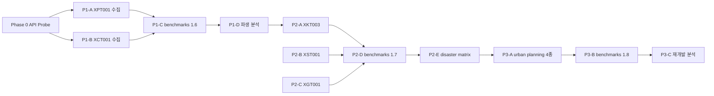

# MLIT API 확장 — AG 실행 계획 (세분화 태스크)

> **근거 문서**: `docs/MLIT_API_EXPANSION_ANALYSIS.md`, `docs/MLIT_API_EXPANSION_ROADMAP.md`  
> **작성**: Cursor (2026-06-18)  
> **실행 주체**: AG (Antigravity) — 코드·수집·benchmarks 반영  
> **검증 주체**: Cursor (`verify:*` gate) → Joseph Phase 승인  
> **SSOT**: `docs/verification/tokyo-ward-series-benchmarks.json` (현재 schema 1.5)

---

## 0. AG 세션 시작 체크리스트

각 Phase 착수 전 **반드시** 읽기:

1. `docs/AG_GSFARK_MLIT_PIPELINE_PROMPT.md`
2. `docs/MLIT_DATA_REFRESH_SOP.md`
3. 이 문서의 해당 Phase 섹션 (**RE 작업 시** → `docs/REGION_EXPANSION_PLAN.md` 해당 슬라이스)
4. 레퍼런스 코드: `scripts/mlit-collector.mjs` (`collectDisaster` = 타일 GeoJSON 패턴)

**환경**: `MLIT_API_KEY` in `.env`  
**금지**: `population_forecast`의 `jukiren+ipss` 구역 덮어쓰기 · md 하단 면책 삽입 · benchmarks에 없는 숫자 창작

**회귀 게이트** (모든 Phase 완료 시):

```bash
cd projects/GSF-Ark
pnpm verify:ep07-tiles
pnpm verify:station-passengers
```

---

## 1. 태스크 의존성 맵



---

## 2. Phase 0 — API 사전 검증 (구현 전 1일)

목적: 로드맵 §10의 불확실성 제거. **코드 본체 착수 전** 완료.

*   **P0-T01** [x]: `XPT001` 1구 프로브 (北区)
*   **P0-T02** [x]: `XCT001` 1구 프로브 (北区)
*   **P0-T03** [x]: `XKT003` 1구 프로브 (北区/板橋区)
*   **P0-T04** [x]: `XST001` 1구 프로브 (北区)
*   **P0-T05** [x]: `XGT001` 1구 프로브 (北区)
*   **P0-T06** [x]: 위 결과를 바탕으로 `docs/verification/MLIT_API_FIELD_MAP.md` 생성. (절대 추측 금지)

**P0-T01 실행 예시** (AG가 `scripts/probe-mlit-api.mjs` 임시 작성 후 실행):

```bash
node scripts/probe-mlit-api.mjs --endpoint XPT001 --ward 北区 --z 14
```

> Joseph 승인 없이 Phase 1 착수 금지. P0-T06이 없으면 파싱 필드명 추측 금지.

---

## 3. Phase 1 — 공간 정보 기반 확장 (schema 1.6)

**목표**: 구 단위 평균 → 거래 건별 좌표 + 감정평가 코멘트  
**예상**: 1~2주 · 약 18개 소태스크

### 3.1 XPT001 — 거래가 포인트

| ID | 태스크 | 수정/생성 파일 | 완료 기준 |
|----|--------|----------------|-----------|
| **P1-T01** | `ENDPOINTS`에 `price_point: XPT001` 추가 | `scripts/mlit-collector.mjs` | 엔드포인트 상수만 추가, 기존 테스트 통과 |
| **P1-T02** | `collectPricePoints(ward, year, noCache)` 골격 | `mlit-collector.mjs` | 北区 1구 `--json` 출력, feature count > 0 |
| **P1-T03** | 타일 루프 (`getWardTiles`) + 캐시 키 `price-point-{cls}-{ward}-{year}-{z}_{x}_{y}` | `mlit-collector.mjs` | 캐시 재사용 확인 (`📁 캐시` 로그) |
| **P1-T04** | GeoJSON 병합 → `docs/verification/data/price-points/{slug}-{year}.geojson` 저장 | `mlit-collector.mjs`, 디렉터리 생성 | 北区 geojson 파일 존재, FeatureCollection 유효 |
| **P1-T05** | 집계 메타 반환 (`count`, `avg_sqm`, `priceClassification`) | `mlit-collector.mjs` | 단가 ±5% 이내 유지 + `tile_coverage_warning` 적용 |
| **P1-T06** | `priceClassification` 02(成約) 기본, 01(取引) 옵션 | CLI `--price-classification` | 02/01 각각 1구 테스트 |
| **P1-T07** | `COLLECTORS` + CLI `--type price-point` 등록 | `mlit-collector.mjs` | `pnpm collect:mlit -- --type price-point --ward 北区 --json` |
| **P1-T08** | 독립 fetch 스크립트 | `scripts/fetch-price-points.mjs` | `--ward` / `--episode` / `--all-wards` 지원 |
| **P1-T09** | 23구 일괄 수집 | data 디렉터리 | 23개 geojson + count 메타 |
| **P1-T10** | `package.json` 스크립트 | `fetch:price-points` | `pnpm fetch:price-points -- --ward 北区` |

**P1-T02 설계 노트** (XIT001 대비):

- 파라미터: `priceClassification`, `year`, `city` + 타일 `z,x,y`, `response_format=geojson`
- 맨션 필터: `Type` ∈ {中古マンション等, 区分所有建物}
- 좌표: `geometry.coordinates` [lon, lat]
- 대용량: benchmarks에는 **경로 참조만** (로드맵 §3.1)

### 3.2 XCT001 — 감정평가서

| ID | 태스크 | 파일 | 완료 기준 |
|----|--------|------|-----------|
| **P1-T11** | `ENDPOINTS.appraisal: XCT001` 추가 | `mlit-collector.mjs` | — |
| **P1-T12** | `collectAppraisal(ward, year, noCache)` | `mlit-collector.mjs` | 北区 points 배열 ≥1 |
| **P1-T13** | 텍스트 파싱: `future_trend`, `comment_summary` (200자 truncate) | `mlit-collector.mjs` | P0-T02 필드맵 준수 |
| **P1-T14** | 캐시 `appraisal-{ward}-{year}.json` | `mlit-collector.mjs` | — |
| **P1-T15** | `scripts/fetch-appraisal.mjs` | 신규 | `--all-wards` 동작 |
| **P1-T16** | 23구 수집 | `.cache/mlit/appraisal-*.json` | 구당 최소 1 point 또는 `coverage_note` |

### 3.3 benchmarks + sync 연동

| ID | 태스크 | 파일 | 완료 기준 |
|----|--------|------|-----------|
| **P1-T17** | `sync-mlit-to-benchmarks.mjs`에 `price_points`, `appraisal_comments` 섹션 | sync 스크립트 | `--types price-point,appraisal --ward 北区 --write` + `tile_coverage_warning` 로직 구현 |
| **P1-T18** | schema_version → `1.6` | `tokyo-ward-series-benchmarks.json` | 두 섹션 23구 키 존재 |
| **P1-T19** | `mlit-collector.mjs` export에 신규 함수 추가 | exports | `sync` import 오류 없음 |

**benchmarks `price_points` 스키마** (구 1개 예):

```json
"北区": {
  "geojson_path": "docs/verification/data/price-points/kita-2025.geojson",
  "count": 354,
  "tile_coverage_warning": true,
  "price_classification": "02",
  "fetched_at": "2026-06-XX"
}
```

**benchmarks `appraisal_comments` 스키마** (구 1개 예):

```json
"北区": {
  "json_path": ".cache/mlit/appraisal-merged-kita-2023.json",
  "count": 110,
  "fetched_at": "2026-06-XX"
}
```

### 3.4 Phase 1 파생 분석 스크립트

| ID | 태스크 | 파일 | 완료 기준 |
|----|--------|------|-----------|
| **P1-T20** | 역 좌표 헬퍼 (station master lat/lon) | `scripts/lib/station-geo.mjs` | 赤羽역 좌표 반환 |
| **P1-T21** | `analyze-station-distance.mjs` v0 | 신규 | 北区 stdout: 도보분 bins + 회귀 slope (n≥30 구만) |
| **P1-T22** | `analyze-disaster-price.mjs` v0 | 신규 | 재해구역 내/외 median 비교 (disaster 타일 + price-points) |
| **P1-T23** | `render-ward-price-map.mjs` v0 | 신규 | 北区 `.webp` 또는 `.png` 산출 (`docs/CHARTS_AND_VISUALS.md` 준수) |
| **P1-T24** | research-pack 확장 | `render-episode-research-pack.mjs` | `price_map` / `appraisal_highlights` 섹션 추가 |
| **P1-T25** | `pnpm analyze:episode` 연동 확인 | `analyze-episode.mjs` | ep07 `--write` 시 신규 섹션 포함 |

### 3.5 Phase 1 게이트

| ID | 태스크 | 완료 기준 |
|----|--------|-----------|
| **P1-G01** | 회귀 | `pnpm verify:ep07-tiles` + `pnpm verify:station-passengers` PASSED |
| **P1-G02** | 표본 정책 | n<30 구는 analyze 스크립트가 "insufficient_n" 출력, 본문 수치 미생성 |
| **P1-G03** | 핸드오프 | Joseph용 요약: 23구 count表, geojson 총 용량, XCT001 커버리지 공백 구 목록 |

**Phase 1 Joseph 승인 후** Phase 2 착수.

---

## 4. Phase 2 — 정책·리스크 완성 (schema 1.7)

**목표**: 입지적정화 + 재해 이력 + 대피장소 → 4분면 리스크  
**예상**: 1~2주 · 약 16개 소태스크

### 4.1 XKT003 — 입지적정화계획

| ID | 태스크 | 파일 | 완료 기준 |
|----|--------|------|-----------|
| **P2-T01** | `collectLocationOptimization(ward, noCache)` | `mlit-collector.mjs` | 타일 fetch + feature 집계 |
| **P2-T02** | 거주유도구역 면적 비율 `residential_induction_coverage_pct` | 집계 로직 | 0~100%, 소수 1자리 |
| **P2-T03** | 도시기능유도구역 수 `urban_function_zones` | 집계 로직 | 정수 |
| **P2-T04** | `scripts/fetch-location-optimization.mjs` | 신규 | 1구 테스트 |
| **P2-T05** | 23구 수집 | — | benchmarks 입력 준비 완료 |

### 4.2 XST001 — 재해 이력

| ID | 태스크 | 파일 | 완료 기준 |
|----|--------|------|-----------|
| **P2-T06** | `collectDisasterHistory(ward, noCache)` | `mlit-collector.mjs` | `collectDisaster` 패턴 복제 |
| **P2-T07** | 재해 유형별 집계 (`flood_events`, `last_flood_year`, …) | 파싱 | P0-T04 필드맵 준수 |
| **P2-T08** | `coverage_status`: surveyed / no_data / partial | 메타 | 공백 구에 `coverage_note` 필수 |
| **P2-T09** | `scripts/fetch-disaster-history.mjs` | 신규 | — |
| **P2-T10** | 23구 수집 + 커버리지 리포트 | stdout 표 | P0-T04 대비 드리프트 없음 |

### 4.3 XGT001 — 긴급대피장소

| ID | 태스크 | 파일 | 완료 기준 |
|----|--------|------|-----------|
| **P2-T11** | `collectEvacuationSites(ward, noCache)` | `mlit-collector.mjs` | 포인트 GeoJSON 집계 |
| **P2-T12** | `site_count`, `total_capacity`, `by_disaster_type` | 집계 | — |
| **P2-T13** | 1인당 수용 여유도 (인구 ÷ capacity) — **jukiren 인구 우선** | `scripts/lib/evacuation-metrics.mjs` | 北区 숫자 1개 산출 |
| **P2-T14** | `scripts/fetch-evacuation-sites.mjs` | 신규 | 23구 |

### 4.4 benchmarks + 파생 분석

| ID | 태스크 | 파일 | 완료 기준 |
|----|--------|------|-----------|
| **P2-T15** | sync에 3섹션 추가 | `sync-mlit-to-benchmarks.mjs` | `location_optimization`, `disaster_history`, `evacuation_sites` |
| **P2-T16** | schema_version → `1.7` | benchmarks.json | 3섹션 × 23구 |
| **P2-T17** | `analyze-disaster-matrix.mjs` | 신규 | 4분면 표 stdout (상정×이력) |
| **P2-T18** | `verify-disaster-complete.mjs` | 신규 | 23구 disaster_risk + disaster_history 키 존재 검사 |
| **P2-T19** | research-pack: `disaster_matrix`, `evacuation_summary`, `policy_zone` | `render-episode-research-pack.mjs` | ep07 pack 샘플 출력 |
| **P2-T20** | `package.json` scripts 등록 | package.json | `analyze:disaster-matrix`, `verify:disaster-complete` |

### 4.5 Phase 2 게이트

| ID | 완료 기준 |
|----|-----------|
| **P2-G01** | `pnpm verify:ep07-tiles` + `pnpm verify:station-passengers` PASSED |
| **P2-G02** | `pnpm verify:disaster-complete` PASSED |
| **P2-G03** | XST001 `coverage_warning`이 benchmarks top-level에 존재 |
| **P2-G04** | Joseph 승인 |

---

## 5. Phase 3 — 도시계획 완전판 (schema 1.8)

**목표**: XKT014/023/024/030 통합 → 재개발·건축 제약 분석  
**예상**: 2~3주 · 약 14개 소태스크

### 5.1 통합 수집

| ID | 태스크 | 파일 | 완료 기준 |
|----|--------|------|-----------|
| **P3-T01** | `ENDPOINTS` 4종 추가 (014/023/024/030) | `mlit-collector.mjs` | — |
| **P3-T02** | `collectUrbanPlanning(ward, noCache)` — `collectDisaster` 구조 복제 | `mlit-collector.mjs` | 4 sub-result |
| **P3-T03** | XKT014: `fire_prevention_zone.coverage_pct` | 집계 | 방화/준방화 면적 비율 |
| **P3-T04** | XKT030: `urban_road_affected_pct` | 집계 | 계획도로 overlap % |
| **P3-T05** | XKT024: `high_utilization_zones` count | 집계 | — |
| **P3-T06** | XKT023: `district_plan_zones` count | 집계 | — |
| **P3-T07** | `scripts/fetch-urban-planning.mjs` | 신규 | `--all-wards` |
| **P3-T08** | 23구 수집 | — | — |

### 5.2 benchmarks + 분석

| ID | 태스크 | 파일 | 완료 기준 |
|----|--------|------|-----------|
| **P3-T09** | `urban_planning` 섹션 sync | `sync-mlit-to-benchmarks.mjs` | 로드맵 §5 스키마 |
| **P3-T10** | schema_version → `1.8` | benchmarks.json | — |
| **P3-T11** | `analyze-redevelopment-potential.mjs` | 신규 | 고도이용지구 ∩ XPT001 저가 percentile |
| **P3-T12** | `analyze-urban-constraints.mjs` | 신규 | zoning(XKT002 기존) × 방화 × 지구계획 교차표 |
| **P3-T13** | research-pack: `redevelopment_potential`, `urban_constraints` | research-pack | — |
| **P3-T14** | XKT002(`zoning`) 미활용 → benchmarks 요약 연동 검토 | sync 또는 collector | 용도지역 top 3 유형 구별 표시 |

### 5.3 Phase 3 게이트

| ID | 완료 기준 |
|----|-----------|
| **P3-G01** | 회귀 gate PASSED |
| **P3-G02** | Phase 1 `price_points` 없으면 P3-T11 스킵 + warning |
| **P3-G03** | Joseph 승인 |

---

## 6. Phase 4 — 생활 인프라 (schema 1.9, 장기)

Joseph가 "육아/학군/의료" 시리즈 확장을 승인한 후에만 착수.

| ID | 태스크 | 요약 |
|----|--------|------|
| **P4-T01** | `collectLifeInfrastructure(ward)` — XKT004~007, 010, 011, 031 | 포인트·폴리곤 혼합 |
| **P4-T02** | `life_infrastructure` benchmarks 섹션 | schema 1.9 |
| **P4-T03** | 학구×가격 (XKT004/005 + XPT001) | Phase 1 의존 |
| **P4-T04** | 보육 밀도 랭킹 | 독립 콘텐츠 |
| **P4-T05** | DID — 수도권 확장 시에만 본문 수치화 | 23구 단독은 tier B 메모만 |

---

## 7. 공통 구현 규칙 (모든 Phase)

### 7.1 파일·캐시 규약

| 항목 | 경로 |
|------|------|
| API 캐시 | `.cache/mlit/{cacheKey}.json` |
| 대용량 GeoJSON | `docs/verification/data/{layer}/` |
| 필드 매핑 SSOT | `docs/verification/MLIT_API_FIELD_MAP.md` (P0-T06) |
| benchmarks | `docs/verification/tokyo-ward-series-benchmarks.json` |

### 7.2 sync-mlit-to-benchmarks 확장 패턴

기존 `wantsType(args, "disaster")` 패턴을 따른다:

```javascript
// 예시 — Phase 1
else if (a === "--types") // 기존
// types에 추가: price-point, appraisal, location-optimization, ...
```

`--types` 미지정 시 **기존 동작 유지** (회귀 방지). 신규 레이어는 명시적 `--types` 필요.

### 7.3 tier 규칙

| 섹션 | tier | 비고 |
|------|------|------|
| price_points | A | geojson 경로 + count; 본문은 파생 분석 결과만 |
| appraisal_comments | A | 인용 시 출처 문구 필수 |
| location_optimization | A | 정책 해석 — 투자 권유 문구 금지 |
| disaster_history | A | `coverage_warning` 각주 필수 |
| evacuation_sites | A | 인구 대비 proxy |
| urban_planning | A | XKT002와 세트 서술 |

### 7.4 API 레이트 리밋

- 타일 간 `sleep(300)` — `collectDisaster`와 동일
- 구 간 `sleep(500)` — `mlit-collector.mjs` main 루프와 동일
- 23구 전체 수집은 **야간 배치** 권장 (AG가 진행률 로그 남길 것)

---

## 8. AG 작업 단위 권장 순서 (1세션 = 1~3태스크)

AG는 **한 세션에 태스크 ID 1~3개만** 완료하고 핸드오프한다.

### 세션 템플릿 A — 수집 함수만

```
1. P*-T0N 구현
2. 北区 단일 구 --json 검증
3. 캐시 히트 재실행
4. [AG→Cursor] 태스크 ID / 변경 파일 / 北区 샘플 stdout
```

### 세션 템플릿 B — benchmarks 반영

```
1. sync 스크립트 확장
2. --ward 北区 --write
3. benchmarks diff 확인 (population_forecast 불변)
4. verify gate
5. [AG→Cursor] diff 요약 + gate 결과
```

### 세션 템플릿 C — 23구 배치

```
1. --all-wards 수집 (진행 로그)
2. 실패 구 목록
3. --write
4. [AG→Joseph] 커버리지 표 + 실패 구
```

---

## 9. package.json 추가 스크립트 (최종 목표)

Phase 완료 시 누적 등록:

```json
"fetch:price-points": "node scripts/fetch-price-points.mjs",
"fetch:appraisal": "node scripts/fetch-appraisal.mjs",
"analyze:station-distance": "node scripts/analyze-station-distance.mjs",
"analyze:disaster-price": "node scripts/analyze-disaster-price.mjs",
"fetch:location-optimization": "node scripts/fetch-location-optimization.mjs",
"fetch:disaster-history": "node scripts/fetch-disaster-history.mjs",
"fetch:evacuation-sites": "node scripts/fetch-evacuation-sites.mjs",
"analyze:disaster-matrix": "node scripts/analyze-disaster-matrix.mjs",
"verify:disaster-complete": "node scripts/verify-disaster-complete.mjs",
"fetch:urban-planning": "node scripts/fetch-urban-planning.mjs",
"analyze:redevelopment": "node scripts/analyze-redevelopment-potential.mjs",
"analyze:urban-constraints": "node scripts/analyze-urban-constraints.mjs"
```

각 스크립트 추가는 **해당 태스크 완료 시점**에만 등록 (한꺼번에 추가 금지).

---

## 10. 첫 AG 세션 추천 (즉시 착수 가능)

| 순서 | 태스크 ID | 예상 시간 | 산출 |
|------|-----------|-----------|------|
| 1 | P0-T01 ~ P0-T06 | 2~4h | `MLIT_API_FIELD_MAP.md` |
| 2 | P1-T01 ~ P1-T04 | 3~5h | 北区 price-points geojson |
| 3 | P1-T05 ~ P1-T10 | 2~3h | CLI + 23구 배치 준비 |
| 4 | P1-T11 ~ P1-T16 | 3~4h | appraisal 北区 |
| 5 | P1-T17 ~ P1-T19 | 2h | benchmarks 1.6 (北区만 먼저 가능) |
| 6 | P1-T20 ~ P1-T25 | 4~6h | analyze + research-pack |
| 7 | P1-G01 ~ P1-G03 | 1h | Phase 1 핸드오프 |

---

## 11. 참조 파일 빠른 링크

| 파일 | 역할 |
|------|------|
| `scripts/mlit-collector.mjs` | 수집 함수 본체 — `collectDisaster` 복제 |
| `scripts/sync-mlit-to-benchmarks.mjs` | benchmarks 병합 |
| `scripts/lib/ward-tiles.mjs` | 타일 bbox |
| `scripts/lib/mlit-sample-policy.mjs` | n<30 정책 |
| `scripts/render-episode-research-pack.mjs` | 작가용 팩 |
| `docs/MLIT_API_EXPANSION_ROADMAP.md` | Phase 정의·스키마 예시 |
| `docs/MLIT_API_EXPANSION_ANALYSIS.md` | 레이어 우선순위·조합 아이디어 |
| **`docs/REGION_EXPANSION_PLAN.md`** | **RE 트랙 — 지역 SSOT·파일럿·AG 슬라이스 (Phase 4와 분리)** |

---

*Claude: Phase 완료 시 이 문서의 체크박스·게이트 항목 검증.*  
*Joseph: Phase 간 승인 게이트.*  
*AG: 태스크 ID 단위 구현·핸드오프.*


## Amendment — Phase 2 Revision (2026-06-18, Joseph 승인)
- **P2-T01~T05**: **DEFERRED (23구)**
- **P2-T15**: sync 섹션을 `disaster_history` + `evacuation_sites` full + `location_optimization` stub 으로 조정
- **P2-T17**: 축 명시 XKT025~029 × XST001 (상정×이력)
- **P2-T19**: `policy_zone` → 정책 맥락 문단으로 변경; `evacuation_summary` 유지
**구현 가드레일 추가:**
- 모든 타일 API에 `city_code === WARD_CODE[ward]` 필터 필수
- XST001 top-level `coverage_warning` 유지 (P2-G03)
- XGT001 capacity 필드 없으면 한계 문서화, 숫자 창작 금지

## Amendment — Phase 3 (2026-06-18)

- **P3-T00 선행 프로브 결과 (XKT014, XKT023, XKT024, XKT030)**
  - XKT014, XKT030은 `city_code` 필드가 존재하여 `feature.properties.city_code === WARD_CODE[ward]` 필터 적용 가능.
  - ⚠️ XKT023, XKT024는 `city_code`가 **없음**. 대신 `city_name` (예: "練馬区") 필드가 있으므로, `feature.properties.city_name === ward` 필터 로직 적용 필수.
- **P3 dominant_type Amendment**: ROADMAP의 XKT014 dominant_type 예시("準防火地域優勢")와 달리, 한국어 렌더링 최적화를 위해 "방화지역" / "준방화지역" 등 한글 용어를 직접 사용하도록 구현 및 승인 완료.
- **P3 zoning_top3 Amendment**: `schema_version` 1.8에서 1.9로 업데이트하며 `zoning_top3`를 `urban_planning` 내부로 통합하여 23구 전수 연동 처리 완료.

---

## 12. Region Expansion (RE) — 별도 트랙 (2026-06-18, Joseph 승인)

MLIT Phase 1~3(23구) 완료 후 **지역 범위 일반화** 작업. Phase 4(생활 인프라)와 **분리**.

| 항목 | 내용 |
|------|------|
| **정본 문서** | `docs/REGION_EXPANSION_PLAN.md` |
| **AG runbook** | **`docs/REGION_EXPANSION_AG_RUNBOOK.md`** — Joseph/Cursor는 `§RE-N`만 지시 |
| **실행** | AG — 슬라이스 ID (`RE-1-T01` …) 단위 |
| **검증** | Cursor — `RE-*-G01` 회귀 게이트 + `pnpm verify:region-pilot` (RE-4) |
| **23구 SSOT** | `tokyo-ward-series-benchmarks.json` **무변경** |
| **파일럿 SSOT** | `greater-tokyo-pilot-benchmarks.json` (신규) |
| **파일럿 4구** | 横浜市西区 · 川崎市中原区 · 鎌倉市 · 狛江市 |

**AG 착수**: RE-1-T01부터. Phase 4 착수 금지 (이연).

**회귀 게이트** (RE 모든 슬라이스 후):

```bash
pnpm verify:disaster-complete
pnpm verify:urban-planning-complete
pnpm verify:ep07-tiles
```
