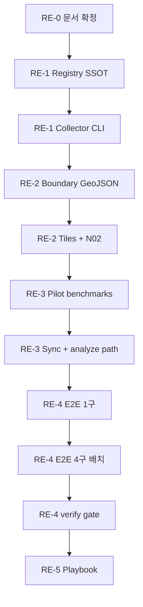

# Region Expansion (RE) — AG 실행 계획 (세분화 슬라이스)

> **작성**: Cursor (2026-06-18)  
> **승인**: Joseph (2026-06-18)  
> **상태**: **🔒 RE 트랙 공식 마감 (2026-06-18)** — 마감·백로그: [`REGION_EXPANSION_CLOSURE.md`](./REGION_EXPANSION_CLOSURE.md)  
> **실행 주체**: AG (Antigravity) — 코드·수집·benchmarks 반영  
> **AG 실행 문서**: [`REGION_EXPANSION_AG_RUNBOOK.md`](./REGION_EXPANSION_AG_RUNBOOK.md) — **Wave 3(§RE-7) 활성**  
> **검증 주체**: Cursor (`verify:*` gate) → Joseph 승인  
> **관계**: MLIT Phase 1~3(23구) **완료** · Phase 4(생활 인프라) **이연** · RE 데이터 **마감**

---

## 0. 목표·범위

### 0.1 목표

Phase 3까지 구축한 MLIT 분석 파이프라인을 **전국 단위로 확장 가능한 아키텍처**로 일반화한다.

- **아키텍처**: 어떤 시·구·정·촌이든 registry에 등록하면 동일 collector로 분석 가능
- **파일럿 검증**: 수도권 **1현 + 소수 시·구** 실수집으로 로직 검증
- **23구 시리즈**: `tokyo-ward-series-benchmarks.json` · Ep.01~09 · 기존 verify gate **무변경**

### 0.2 파일럿 대상 (Cursor 권장안 — 확정)

| 구분 | name_ja | city_code | prefecture | 선정 이유 |
|------|---------|-----------|------------|-----------|
| pilot | 横浜市西区 | 14103 | 神奈川県 | 政令市·区, 대형·타일 부담 |
| pilot | 川崎市中原区 | 14133 | 神奈川県 | 도쿄 직결·인구 밀집 |
| pilot | 鎌倉市 | 14204 | 神奈川県 | 일반市·면적·형태 다름 |
| smoke | 狛江市 | 13219 | 東京都 | Phase 2 XKT003 프로브 실증지 |

**Reserve (2차 파일럿, RE 완료 후):** 戸田市 `11224` (埼玉県) — XKT003 재검증

### 0.3 Phase 3 커버리지 (파일럿 대상 collector)

| 섹션 | API | 파일럿 | 비고 |
|------|-----|--------|------|
| `disaster_risk` | XKT025~029 | ✅ | 타일 + polygon clip |
| `disaster_history` | XST001 | ✅ | |
| `evacuation_sites` | XGT001 | ✅ | |
| `urban_planning` | XKT014/023/024/030 | ✅ | 023/024 → `city_name` 필터 |
| `zoning_top3` | XKT002 | ✅ | `urban_planning` 내 |
| `price_points` | XPT001 | ✅ | geojson per slug |
| `mlit_mansion_2025_q1_q4` | XIT001 | ✅ | `city` 파라미터 |
| `appraisal` | XCT001 | ✅ | pref + city suffix |
| `station_passengers` | XKT015 | ⚠️ | N02 확장 후 (RE-2) |
| `population_forecast` | XKT013 | ⏸ | preset 수동 — RE-4 optional |
| `land_price_official` | XPT002 | ⏸ | optional |
| SUUMO / jukiren / episode manifest | — | ❌ | RE 범위 외 |

### 0.4 설계 원칙

1. **하위 호환**: CLI `--ward`, `getWardTiles`, `WARD_CODE` export 유지 (registry에서 생성)
2. **SSOT 분리**: 23구 = `tokyo-ward-series-benchmarks.json` · 파일럿 = `greater-tokyo-pilot-benchmarks.json`
3. **회귀 방지**: 23구 verify gate 코드·기대값 변경 금지
4. **추측 금지**: boundary·bbox는 audit 스크립트 또는 프로브로 검증 후 등록
5. **슬라이스 단위**: 슬라이스 완료 → Cursor verify → Joseph 승인 → 다음 슬라이스

---

## 1. AG 세션 시작 체크리스트

각 RE 슬라이스 착수 전 **반드시** 읽기:

1. `docs/AG_GSFARK_MLIT_PIPELINE_PROMPT.md`
2. `docs/MLIT_DATA_REFRESH_SOP.md`
3. **이 문서** 해당 슬라이스 섹션
4. `docs/MLIT_API_EXPANSION_AG_IMPLEMENTATION_PLAN.md` — Phase 2/3 필터 가드레일
5. 레퍼런스: `scripts/mlit-collector.mjs` (`collectUrbanPlanning`, `collectDisaster`)

**환경**: `MLIT_API_KEY` in `.env`

**금지**:
- `tokyo-ward-series-benchmarks.json`에 파일럿 municipality 데이터 쓰기
- `population_forecast` jukiren+ipss 덮어쓰기
- benchmarks 숫자 창작 · md 하단 면책 삽입

---

## 2. 슬라이스 의존성 맵



---

## 3. RE-0 — 설계 확정 (Cursor 완료)

| ID | 태스크 | 담당 | 상태 |
|----|--------|------|------|
| **RE-0-T01** | `REGION_EXPANSION_PLAN.md` 작성 | Cursor | ✅ |
| **RE-0-T02** | ROADMAP·AG_IMPLEMENTATION_PLAN에 RE 참조 추가 | Cursor | ✅ |
| **RE-0-T03** | Joseph 승인 (파일럿 4구·SSOT 분리·Phase 4 이연) | Joseph | ✅ |

**Joseph 승인 게이트**: RE-1 착수 전 RE-0-T03 확인.

---

## 4. RE-1 — Municipality Registry SSOT

**목표**: `WARD_CODE` / `WARD_BOUNDS` 하드코딩을 registry로 흡수. 23구 동작 동일.

### 4.1 Registry 스키마·시드

| ID | 태스크 | 수정/생성 파일 | 완료 기준 |
|----|--------|----------------|-----------|
| **RE-1-T01** | `municipalities.json` 스키마 정의 + `schema_version: "1.0"` | `docs/verification/municipalities.json` | JSON 유효; 필수 필드 문서화 (§4.5) |
| **RE-1-T02** | 기존 23구를 `region_tier: "tokyo23"`로 registry 시드 | `municipalities.json` | 23 entries; `city_code` 13101~13123 일치 |
| **RE-1-T03** | 파일럿 4구 registry 등록 (`region_tier: "pilot"`) | `municipalities.json` | 14103, 14133, 14204, 13219; bbox는 placeholder 허용 |
| **RE-1-T04** | `regions.tokyo23` / `regions.pilot` 코드 배열 | `municipalities.json` | `listRegion("pilot")` → 4 codes |

### 4.2 Registry 라이브러리

| ID | 태스크 | 파일 | 완료 기준 |
|----|--------|------|-----------|
| **RE-1-T05** | `getMunicipality({ code \| name_ja })` | `scripts/lib/municipality-registry.mjs` | 北区·14103 lookup OK |
| **RE-1-T06** | `listRegion(regionId)` | 동일 | `tokyo23` → 23, `pilot` → 4 |
| **RE-1-T07** | `getMunicipalityBbox(name_ja)` | 동일 | 23구 bbox가 기존 `WARD_BOUNDS`와 동일 |
| **RE-1-T08** | `bootstrap-municipalities.mjs` — XIT002로 이름·코드 시드 (bbox 미포함) | `scripts/bootstrap-municipalities.mjs` | `--prefecture 14` stdout/JSON 출력 |

### 4.3 Collector·타일 리팩터 (하위 호환)

| ID | 태스크 | 파일 | 완료 기준 |
|----|--------|------|-----------|
| **RE-1-T09** | `ward-tiles.mjs`: bbox를 registry에서 로드 | `scripts/lib/ward-tiles.mjs` | `getWardTiles("北区")` 타일 수 기존과 동일 |
| **RE-1-T10** | `mlit-collector.mjs`: `WARD_CODE`/`WARD_SLUG`를 registry `tokyo23`에서 생성 | `mlit-collector.mjs` | export 유지; 北区 collect 1회 성공 |
| **RE-1-T11** | CLI `--municipality <name_ja>` ( `--ward` alias ) | `mlit-collector.mjs` | `--municipality 横浜市西区` 파싱 |
| **RE-1-T12** | CLI `--region tokyo23\|pilot` (다구 배치) | `mlit-collector.mjs` | `--region tokyo23 --type disaster --ward` 대체 가능 |
| **RE-1-T13** | unknown municipality → 명확한 에러 메시지 | `mlit-collector.mjs` | registry 미등록 시 throw |

### 4.4 RE-1 회귀 게이트 (Cursor)

```bash
cd projects/GSF-Ark
pnpm verify:disaster-complete
pnpm verify:urban-planning-complete
pnpm verify:ep07-tiles
node scripts/mlit-collector.mjs --type disaster --ward 北区 --json
```

**RE-1-G01**: 위 4개 모두 pass → Joseph RE-1 승인.

---

## 5. RE-2 — Boundary·타일·역 인프라

**목표**: 파일럿 4구에 행정경계·타일·역 데이터 연결.

### 5.1 Boundary GeoJSON

| ID | 태스크 | 파일 | 완료 기준 |
|----|--------|------|-----------|
| **RE-2-T01** | 神奈川 파일럿 3구 + 狛江 boundary GeoJSON | `docs/verification/data/kanagawa-pilot-boundary.geojson` (+ 狛江 feature 포함 또는 별도 파일 + registry `boundary_file` 참조) | Feature ≥ 4; property에 municipality name 식별 가능 |
| **RE-2-T02** | `municipality-polygon.mjs` — `isPointInMunicipality`, `getMunicipalityPolygons` | `scripts/lib/municipality-polygon.mjs` | 狛江市 좌표 spot test pass |
| **RE-2-T03** | `ward-polygon.mjs` → municipality-polygon 위임 (alias) | `scripts/lib/ward-polygon.mjs` | 23구 `isPointInWard` 회귀 pass |
| **RE-2-T04** | registry `boundary_property` 필드 문서화·적용 | `municipalities.json` | 23구=N03_004, pilot=N03_007 등 명시 |

### 5.2 Bbox·타일 audit

| ID | 태스크 | 파일 | 완료 기준 |
|----|--------|------|-----------|
| **RE-2-T05** | 파일럿 4구 bbox 확정 (registry 업데이트) | `municipalities.json` | `audit-ward-tiles.mjs` tile_count > 0 각 구 |
| **RE-2-T06** | `audit-ward-tiles.mjs` → `--municipality` 일반화 | `scripts/audit-ward-tiles.mjs` | `--municipality 横浜市西区` 동작 |
| **RE-2-T07** | 필요 시 `MUNICIPALITY_TILE_OVERRIDES` (registry 또는 tiles lib) | `ward-tiles.mjs` 또는 registry | bleed 구역 수동 보강 문서화 |

### 5.3 역(N02) 확장

| ID | 태스크 | 파일 | 완료 기준 |
|----|--------|------|-----------|
| **RE-2-T08** | `prepare-n02-region.mjs` — 神奈川 + 狛江 역 subset GeoJSON | `docs/verification/data/n02-stations-kanagawa-komae.geojson` | feature > 0 |
| **RE-2-T09** | `station-master.mjs`: registry `city_code`로 역 조회 | `scripts/lib/station-master.mjs` | 横浜市西区 `getStationsByWard("14103")` ≥ 1역 |
| **RE-2-T10** | 23구 N02 경로 회귀 | `station-master.mjs` | 北区 역 목록 기존과 동일 |

### 5.4 RE-2 회귀 게이트 (Cursor)

```bash
pnpm verify:ep07-tiles
pnpm verify:station-passengers
node scripts/audit-ward-tiles.mjs --municipality 横浜市西区
node scripts/audit-ward-tiles.mjs --municipality 狛江市
```

**RE-2-G01**: 23구 verify pass + 파일럿 4구 audit tile_count > 0.

---

## 6. RE-3 — Pilot Benchmarks·Sync

**목표**: 23구 SSOT와 분리된 파일럿 benchmarks + sync 경로.

### 6.1 Pilot benchmarks 파일

| ID | 태스크 | 파일 | 완료 기준 |
|----|--------|------|-----------|
| **RE-3-T01** | `greater-tokyo-pilot-benchmarks.json` 스캐폴드 | `docs/verification/greater-tokyo-pilot-benchmarks.json` | `schema_version: "1.0-pilot"`; 빈 `wards: {}` 섹션 shell (Phase 3 섹션명 동일) |
| **RE-3-T02** | `description`·`region`·`municipalities` 메타 | 동일 | pilot 4구 코드 목록 명시 |
| **RE-3-T03** | 23구 benchmarks 파일 **미수정** 확인 | — | git diff에 `tokyo-ward-series-benchmarks.json` 없음 |

### 6.2 Sync·fetch 일반화

| ID | 태스크 | 파일 | 완료 기준 |
|----|--------|------|-----------|
| **RE-3-T04** | `sync-mlit-to-benchmarks.mjs` `--region pilot\|tokyo23` | `sync-mlit-to-benchmarks.mjs` | `pilot` → pilot JSON 경로 |
| **RE-3-T05** | `--benchmarks-path` override | 동일 | 명시 경로 write |
| **RE-3-T06** | municipality 리스트: `listRegion(region)` 사용 | 동일 | `--all-wards` = `tokyo23` alias |
| **RE-3-T07** | fetch 스크립트 4종에 `--region` 전달 | `fetch-urban-planning.mjs`, `fetch-disaster-history.mjs`, `fetch-evacuation-sites.mjs`, `fetch-price-points.mjs` | `--region pilot --municipality 狛江市` |

### 6.3 Analyze 스크립트

| ID | 태스크 | 파일 | 완료 기준 |
|----|--------|------|-----------|
| **RE-3-T08** | `--benchmarks-path` CLI 옵션 | `analyze-disaster-matrix.mjs`, `analyze-disaster-price.mjs`, `analyze-redevelopment-potential.mjs`, `analyze-urban-constraints.mjs` | pilot JSON 읽기 성공 |
| **RE-3-T09** | `render-episode-research-pack.mjs` — pilot 모드 optional (문서만, 구현 optional) | — | RE-4 후 필요 시 |

### 6.4 RE-3 회귀 게이트 (Cursor)

```bash
pnpm verify:disaster-complete
pnpm verify:urban-planning-complete
node scripts/sync-mlit-to-benchmarks.mjs --region pilot --municipality 狛江市 --types disaster --dry-run
# dry-run 없으면 --write 없이 ward 1개 JSON stdout 확인
```

**RE-3-G01**: 23구 verify pass + sync가 pilot 경로 인식.

---

## 7. RE-4 — 파일럿 E2E 수집·검증

**목표**: Phase 3 전 스택을 파일럿 4구에 적용. Cursor verify gate 신설.

### 7.1 단계적 수집 (권장 순서)

| ID | 태스크 | 명령 예시 | 완료 기준 |
|----|--------|-----------|-----------|
| **RE-4-T01** | 横浜市西区 disaster 3종 | `sync --region pilot --municipality 横浜市西区 --types disaster,disaster-history,evacuation --write` | 3 섹션 ward 키 존재 |
| **RE-4-T02** | 横浜市西区 urban_planning + zoning | `--types urban-planning,zoning --write` | `coverage_status` ∈ {ok, partial, tile_coverage_warning} |
| **RE-4-T03** | 横浜市西区 price + price_points + appraisal | `--types price,price-point,appraisal --write` | count ≥ 0 (0이면 `note` 필수) |
| **RE-4-T04** | 나머지 3구 동일 스택 | `--region pilot` loop | 4/4 municipalities |
| **RE-4-T05** | station (RE-2 완료 시) | `--types station --write` | top_station 또는 note |
| **RE-4-T06** | XKT003 狛江市 reprobe | `probe-mlit-api.mjs` 또는 collector | in-ward polygon > 0 (Phase 2 defer 역검증) |
| **RE-4-T07** | `analyze-disaster-matrix` pilot | `--benchmarks-path greater-tokyo-pilot-benchmarks.json` | stdout 4구 요약 |

### 7.2 Verify gate (Cursor 신규)

| ID | 태스크 | 파일 | 완료 기준 |
|----|--------|------|-----------|
| **RE-4-T08** | `verify-region-pilot.mjs` | `scripts/verify-region-pilot.mjs` | pilot 4구 × 필수 섹션 assertion |
| **RE-4-T09** | `package.json` `verify:region-pilot` | `package.json` | `pnpm verify:region-pilot` |

**필수 섹션 (pilot verify):**
- `disaster_risk`, `disaster_history`, `evacuation_sites`, `urban_planning`
- 각 ward: `coverage_status` 존재
- `disaster_history.coverage_warning` top-level (pilot용 문구 허용)

### 7.3 RE-4 최종 게이트 (Cursor)

```bash
pnpm verify:region-pilot
pnpm verify:disaster-complete
pnpm verify:urban-planning-complete
pnpm verify:ep07-tiles
```

**RE-4-G01**: 전부 pass → Joseph RE 완료 승인.

**핸드오프 산출물 (AG → Cursor/Joseph):**
1. pilot benchmarks 커버리지 표 (4구 × 섹션)
2. `tile_coverage_warning` 구 목록
3. XKT003 狛江 reprobe 결과 (defer 해제 여부 권고)
4. 실패·공백 구와 원인 1줄

---

## 8. RE-5 — 운영 Playbook

| ID | 태스크 | 파일 | 완료 기준 |
|----|--------|------|-----------|
| **RE-5-T01** | 신규 municipality 추가 체크리스트 (§9) AG 검증 | 이 문서 §9 | Joseph 확인 |
| **RE-5-T02** | `MLIT_API_FIELD_MAP.md` — pilot 필터 노트 (city_name 구) | `docs/verification/MLIT_API_FIELD_MAP.md` | 1절 amendment |
| **RE-5-T03** | `WEEKLY_STATUS.md` RE 완료 한 줄 | `WEEKLY_STATUS.md` | 선택 |

---

## 9. 신규 Municipality 추가 Playbook

1. **코드 확인**: `node scripts/bootstrap-municipalities.mjs --prefecture XX` 또는 [総務省 市区町村コード](https://www.soumu.go.jp/)
2. **registry 등록**: `municipalities.json` — `city_code`, `name_ja`, `name_en_slug`, `prefecture_code`, `admin_level`, `bbox`, `region_tier`
3. **boundary**: GeoJSON feature 추가 (`boundary_file` / `boundary_property`)
4. **타일 audit**: `node scripts/audit-ward-tiles.mjs --municipality <name>`
5. **수집**: `pnpm sync:mlit-benchmarks -- --region <tier> --municipality <name> --types ... --write`
6. **검증**: `pnpm verify:region-pilot` (또는 region별 verify 확장)
7. **콘텐츠**: benchmarks lookup만 — 에피소드 manifest는 별도 기획

---

## 10. `municipalities.json` 스키마 (RE-1-T01)

```json
{
  "schema_version": "1.0",
  "municipalities": {
    "13117": {
      "name_ja": "北区",
      "name_en_slug": "kita",
      "prefecture_code": "13",
      "prefecture_ja": "東京都",
      "admin_level": "ku",
      "parent_city": null,
      "region_tier": "tokyo23",
      "bbox": { "minLat": 0, "maxLat": 0, "minLon": 0, "maxLon": 0 },
      "boundary_file": "tokyo-wards-boundary.geojson",
      "boundary_property": "N03_004",
      "tile_overrides": [],
      "enabled_collectors": ["disaster", "urban_planning", "price", "price_points", "appraisal", "station", "population", "landprice", "zoning"]
    }
  },
  "regions": {
    "tokyo23": { "label": "東京都23区", "codes": ["13101", "…"] },
    "pilot": { "label": "Greater Tokyo pilot", "codes": ["14103", "14133", "14204", "13219"] }
  }
}
```

---

## 11. AG 세션 추천 순서 (슬라이스 단위)

| 순서 | 슬라이스 ID | 예상 | 산출 |
|------|-------------|------|------|
| 1 | RE-1-T01 ~ RE-1-T08 | 4~6h | `municipalities.json` + registry lib |
| 2 | RE-1-T09 ~ RE-1-T13 | 3~5h | collector CLI 리팩터 |
| 3 | — | — | **Cursor RE-1-G01** |
| 4 | RE-2-T01 ~ RE-2-T07 | 4~6h | boundary + bbox |
| 5 | RE-2-T08 ~ RE-2-T10 | 3~4h | N02 + station |
| 6 | — | — | **Cursor RE-2-G01** |
| 7 | RE-3-T01 ~ RE-3-T09 | 3~5h | pilot benchmarks + sync |
| 8 | — | — | **Cursor RE-3-G01** |
| 9 | RE-4-T01 ~ RE-4-T07 | 6~8h | 4구 수집 + XKT003 |
| 10 | RE-4-T08 ~ RE-4-T09 | 2~3h | verify gate |
| 11 | — | — | **Cursor RE-4-G01** |
| 12 | RE-5-T01 ~ RE-5-T03 | 1~2h | playbook |

**총 예상**: ~2주 (ep08 집필과 병행 가능).

---

## 12. 역할 분담

| 역할 | 담당 |
|------|------|
| 계획·슬라이스·verify gate 설계 | **Cursor** |
| 코드·수집·benchmarks 구현 | **AG** |
| 슬라이스 게이트 승인 | **Joseph** |
| ep08~09 집필 | **Joseph/AG** (RE와 병행) |
| Phase 4 생활 인프라 | **이연** |

---

## 13. 참조 파일

| 파일 | 역할 |
|------|------|
| `docs/verification/municipalities.json` | 지역 SSOT (RE-1) |
| `docs/verification/greater-tokyo-pilot-benchmarks.json` | 파일럿 benchmarks (RE-3) |
| `docs/verification/tokyo-ward-series-benchmarks.json` | 23구 SSOT — **불변** |
| `scripts/lib/municipality-registry.mjs` | registry API |
| `scripts/mlit-collector.mjs` | collector 본체 |
| `scripts/sync-mlit-to-benchmarks.mjs` | benchmarks 병합 |
| `docs/MLIT_API_EXPANSION_AG_IMPLEMENTATION_PLAN.md` | Phase 1~3 태스크·가드레일 |

---

*Cursor: RE 슬라이스 완료 시 §4~7 회귀 게이트 실행.*  
*Joseph: RE-1 / RE-2 / RE-3 / RE-4 게이트 승인.*  
*AG: 슬라이스 ID 단위 구현·핸드오프.*
